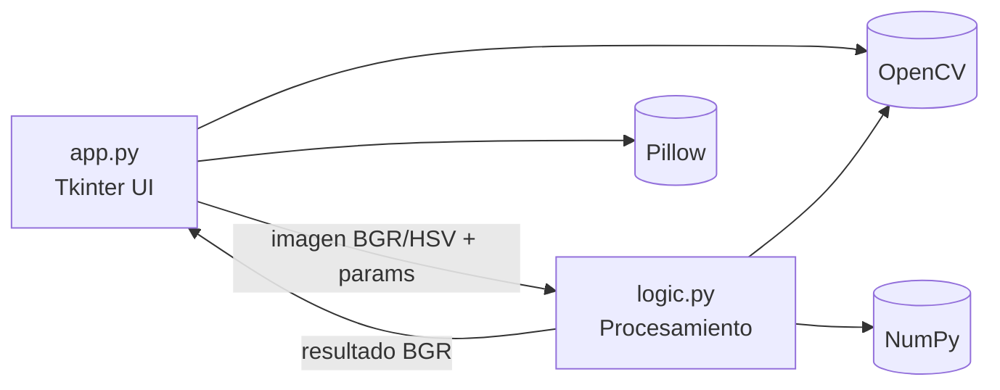
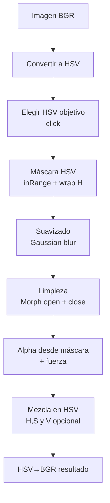

# Color Replace App

Reemplazo de color en imágenes (HSV + OpenCV) con interfaz de escritorio (Tkinter)

- Autor: (tu nombre)
- Fecha: 12 de febrero de 2026

<!--
Notas (1 frase): El objetivo es mostrar una herramienta simple pero robusta para reemplazar un color en una imagen con controles finos.
-->

---

## Agenda

- Problema y objetivo
- Funcionalidades (qué resuelve)
- Arquitectura y stack
- Tour del código: app.py (UI)
- Tour del código: logic.py (procesamiento)
- Flujo de usuario (demo)
- Consideraciones (calidad, rendimiento, límites)
- Próximos pasos

---

## Problema

Cambiar un color “objetivo” en una imagen parece fácil, pero en la práctica:

- La iluminación cambia el brillo del color
- Hay ruido, compresión JPG y gradientes
- Los bordes del objeto tienen antialiasing
- Se necesitan ajustes para evitar “recortes” y artefactos

---

## Objetivo del proyecto

Construir una app de escritorio que permita:

- Seleccionar un color objetivo con un click
- Elegir un color destino
- Controlar el reemplazo con parámetros simples
- Obtener un resultado visual inmediato

---

## Qué hace (funcionalidades)

- Carga imágenes `JPG/PNG/BMP`
- Selección por click del color objetivo en la imagen
- Selección del color destino con `colorchooser`
- Controles:
  - Tolerancia en HSV
  - Suavizado (feather) con Gaussian blur
  - Limpieza de ruido con morfología (open/close)
  - Fuerza de mezcla (alpha)
  - Opción “Mantener brillo (V)”
- Vista previa de selección (tinte rojo)

---

## Stack tecnológico

- **Python 3.9+**
- **Tkinter**: UI y eventos
- **OpenCV (`cv2`)**: conversión de color, máscaras, morfología
- **NumPy**: operaciones vectorizadas y blending
- **Pillow (PIL)**: mostrar la imagen en el `Canvas`

---

## Estructura del proyecto

- `app.py`
  - Interfaz (Tkinter)
  - Manejo de eventos (click en canvas)
  - Carga/visualización
  - Lectura de sliders y llamada a la lógica

- `logic.py`
  - Conversión RGB→HSV compatible con OpenCV
  - Creación de máscara HSV (incluye wrap-around en H)
  - Reemplazo con mezcla (alpha)
  - Vista previa (tinte)

---

## Arquitectura 

<!--
Notas: separación clara: UI no “sabe” del algoritmo; la lógica no “sabe” de Tkinter.
-->

---

## Idea clave 

Este proyecto se entiende mejor si lo piensas como 2 capas:

- **UI (app.py):** botones, sliders, canvas, selección con click, mostrar imágenes.
- **Procesamiento (logic.py):** crear máscara del color y reemplazarlo.

La UI solo llama funciones de `logic.py` y muestra el resultado.

---

## Flujo de usuario (demo)

1) **Cargar imagen**
2) **Seleccionar con click** → click sobre el color objetivo
3) **Elegir color destino…**
4) Ajustar sliders si hace falta
5) **Procesar** → se muestra resultado en el canvas

Tip: usar “Ver original” para comparar rápido.

---

## Datos y formatos (muy importante)

En este proyecto verás estos formatos todo el tiempo:

- **BGR** (OpenCV): orden de canales Azul-Verde-Rojo.
- **RGB** (Pillow / UI): orden Rojo-Verde-Azul.
- **HSV** (OpenCV): tono/saturación/brillo, usado para seleccionar colores mejor.
- **Máscara**: imagen en escala de grises (0..255) que indica “qué píxeles cambiar”.

Regla práctica:
- `app.py` suele mostrar en pantalla (con Pillow) y manejar eventos.
- `logic.py` suele trabajar con arrays NumPy + OpenCV.

---

## Tour del código: app.py (vista general)

`app.py` hace 5 cosas:

1) Importa dependencias y maneja si faltan.
2) Crea la ventana y los controles (botones/sliders).
3) Carga una imagen y la convierte a HSV.
4) Captura el color objetivo con un click.
5) Llama a `logic.py` para máscara y reemplazo, y muestra el resultado.

---

## app.py: imports y dependencias

Al inicio:

- Usa `tkinter` para UI.
- Intenta importar `cv2` y `numpy`.
- Intenta importar `PIL.Image` e `ImageTk`.

Si falla alguna importación, asigna `None` y luego la UI muestra un error amigable.

Detalle importante:

- `logic.cv2 = cv2` y `logic.np = np`

Esto “inyecta” las dependencias dentro de `logic.py` para que sus funciones puedan usarlas.

---

## app.py: estado (variables principales)

En `ColorReplaceApp.__init__` se guardan datos que se reutilizan:

- `image_bgr`: imagen original tal como la lee OpenCV.
- `image_hsv`: misma imagen convertida a HSV.
- `result_bgr`: resultado después del reemplazo.
- `pick_mode`: si está activo el modo “seleccionar con click”.
- `picked_hsv`: el HSV capturado del pixel donde hiciste click.
- `target_hsv`: el HSV destino (color nuevo).
- `display_info`: info para mapear clicks en el canvas → pixel real.

---

## app.py: construir la UI (_build_ui)

`_build_ui()` crea dos columnas:

- `left`: controles (botones y sliders).
- `right`: un `Canvas` para mostrar la imagen.

También hace el “cableado” de eventos:

- `Button(..., command=self.load_image)`
- `self.canvas.bind("<Button-1>", self.on_canvas_click)`

O sea: cuando haces click, se llama `on_canvas_click`.

---

## app.py: sliders (parámetros)

Los parámetros se guardan en variables Tk:

- `tol_var` (0..60): tolerancia HSV
- `blur_var` (1..31): suavizado/feather
- `morph_var` (0..8): iteraciones morfológicas
- `mix_var` (0..100): fuerza de mezcla
- `keep_v_var` (checkbox): mantener brillo

Cuando procesas, se leen con `.get()` y se pasan a `logic.py`.

---

## app.py: cargar imagen (load_image)

Pasos sencillos:

1) Verifica dependencias (`cv2` y `PIL`).
2) Abre un selector de archivo (JPG/PNG/BMP).
3) Lee la imagen con `cv2.imread` → `image_bgr`.
4) Convierte a HSV: `cv2.cvtColor(..., COLOR_BGR2HSV)` → `image_hsv`.
5) Limpia estados viejos (`result_bgr`, `picked_hsv`).
6) Llama `show_image(image_bgr)`.

Si algo falla, muestra `messagebox.showerror`.

---

## app.py: mostrar imágenes (show_image y _show_on_canvas)

OpenCV y Pillow usan distinto orden de color:

- `cv2` trabaja en **BGR**.
- Pillow espera **RGB**.

Por eso `show_image` hace:

- `cv2.cvtColor(bgr, cv2.COLOR_BGR2RGB)`
- `Image.fromarray(...)`

Luego `_show_on_canvas`:

- Calcula el escalado para que la imagen quepa
- La centra en el canvas
- Guarda `display_info` (scale y offsets)
- Crea `ImageTk.PhotoImage` y la dibuja

---

## app.py: modo selección (enable_pick y on_canvas_click)

`enable_pick()` solo hace:

- `self.pick_mode = True`
- Actualiza el status para indicar “haz click en la imagen”

Luego `on_canvas_click(event)`:

- Verifica que el modo esté activo y que haya imagen
- Comprueba si el click cayó dentro del área donde está la imagen
- Convierte coordenadas del canvas a coordenadas reales de la imagen (usando `display_info`)
- Lee el pixel HSV: `self.image_hsv[iy, ix]`
- Guarda `picked_hsv` y apaga `pick_mode`
- Muestra una preview de selección

---

## app.py: preview de selección (_show_selection_preview)

Este método sirve para “ver qué estás seleccionando” antes de reemplazar.

Hace:

1) Llama `logic.crear_mascara_hsv(...)`
2) Llama `logic.crear_vista_previa(image_bgr, mask)`
3) Muestra la preview en el canvas

Así puedes ajustar tolerancia/blur/morph y volver a seleccionar si capturaste demasiado o muy poco.

---

## app.py: procesar (process)

Es el botón principal.

Valida:

- hay `cv2` y `numpy`
- hay imagen cargada (`image_hsv`)
- hay color objetivo (`picked_hsv`)

Luego:

1) Crea máscara: `logic.crear_mascara_hsv(...)`
2) Reemplaza: `logic.reemplazar_color(...)`
3) Muestra resultado

Si algo falla, muestra un mensaje claro.

---

## Tour del código: logic.py (vista general)

`logic.py` es un módulo de funciones, y cada función tiene un trabajo concreto:

- `convertir_rgb_a_hsv`: convierte el color destino (que viene de la UI en RGB) al HSV de OpenCV.
- `crear_mascara_hsv`: detecta qué píxeles se parecen al color objetivo.
- `reemplazar_color`: mezcla el color destino solo donde la máscara “dice”.
- `crear_vista_previa`: tiñe en rojo para visualizar la selección.
- `_clamp`: helper para asegurar rango 0..255.

---

## logic.py: convertir_rgb_a_hsv (por qué existe)

Cuando eliges el color destino con el picker, Tkinter te da **RGB (0..255)**.

Pero para reemplazar dentro de una imagen HSV de OpenCV, conviene tener el destino también en HSV.

La función:

- “normaliza” a 0..1
- usa `colorsys.rgb_to_hsv`
- reescala a rangos de OpenCV:
  - H: 0..179
  - S: 0..255
  - V: 0..255

---

## logic.py: crear_mascara_hsv (qué devuelve)

Entrada:

- `image_hsv`: imagen HSV completa
- `color_hsv`: el HSV objetivo (capturado con click)
- `tolerancia`, `suavizado`, `morph`: parámetros

Salida:

- `mask`: imagen (alto x ancho) con valores 0..255

Interpretación:

- 0 = “no cambiar este pixel”
- 255 = “cambiar este pixel al máximo”

---

## logic.py: crear_mascara_hsv (paso a paso)

1) Valida que haya imagen y dependencias.
2) Calcula rangos min/max para H, S y V alrededor del color objetivo.
3) Usa `cv2.inRange` para marcar qué píxeles caen en el rango.
4) Si el tono H se sale del rango (0..179), crea 2 máscaras y las combina (OR).
5) Suaviza con `GaussianBlur` (feather) para bordes más suaves.
6) Limpia con morfología (open/close) para reducir ruido.

---

## logic.py: suavizado (por qué obliga kernel impar)

OpenCV espera que el tamaño del kernel de `GaussianBlur` sea impar.

Si el usuario elige un número par en el slider, el código hace:

- si `suavizado % 2 == 0` → `suavizado += 1`

Así siempre funciona y no rompe la app.

---

## logic.py: reemplazar_color (idea simple)

Objetivo: cambiar el color **solo donde la máscara lo indica**.

Para eso:

- Convierte la máscara a `alpha` (0..1)
- Multiplica `alpha` por la fuerza elegida (0..100)
- Mezcla canales HSV con ese `alpha`

Punto clave: no es un “cambio duro” (todo o nada), es una mezcla gradual.

---

## logic.py: reemplazar_color (mantener brillo)

Si `mantener_brillo` está activo:

- Solo cambia **H** y **S**
- Deja **V** como estaba

Esto suele verse más natural porque se mantienen sombras y brillos originales.

Si está desactivado:

- También mezcla V hacia el brillo del color destino.

---

## logic.py: crear_vista_previa (para entender la selección)

Esta función no reemplaza el color final.

Solo hace una “superposición” roja:

- `tint` es una imagen roja del tamaño de la original
- calcula un `alpha` suave a partir de la máscara
- mezcla base y tint

Sirve para depurar rápidamente: “¿mi máscara está bien?”

---

## Errores comunes y cómo resolverlos

- **No se ve nada / error de importación:** instalar `opencv-python`, `numpy`, `pillow`.
- **Selecciona demasiado:** bajar tolerancia o subir morph.
- **Bordes feos / recorte:** subir suavizado (feather) un poco.
- **Cambia el brillo y se ve artificial:** activar “Mantener brillo (V)”.

---

## Mini-guion para exponer (2-3 minutos)

1) “La UI está en `app.py`: cargo la imagen, selecciono un pixel y ajusto sliders.”
2) “La lógica está en `logic.py`: crea una máscara HSV y hace blending.”
3) “La preview en rojo me muestra si la selección es correcta.”
4) “Procesar aplica el reemplazo con fuerza y opción de mantener brillo.”

---

## Por qué HSV (y no RGB)

HSV separa mejor:

- **H (Hue / tono)**: “qué color es”
- **S (Saturation)**: intensidad del color
- **V (Value)**: brillo

Ventaja práctica: la selección es más robusta a cambios de iluminación que en RGB.

---

## Pipeline del algoritmo (resumen visual)

---

## Máscara HSV (detalle)

Se define un rango alrededor del color objetivo:

- $H \in [H_t - tol, H_t + tol]$ con wrap-around en 0..179
- $S \in [S_t - tol, S_t + tol]$ (0..255)
- $V \in [V_t - tol, V_t + tol]$ (0..255)

Y se usa `cv2.inRange`.

---

## Wrap-around del tono (H)

OpenCV usa $H\in[0,179]$. Si $H_t - tol < 0$ o $H_t + tol > 179$:

- Se generan **dos rangos** y se combinan con OR

Esto evita fallos al seleccionar tonos cercanos a 0/179 (por ejemplo rojos).

---

## Feather (suavizado de bordes)

- La máscara binaria se suaviza con `GaussianBlur`
- Se fuerza kernel impar (si el usuario elige par, se suma 1)

Beneficio:
- bordes más naturales (menos “corte”)
- mejor integración con antialiasing

---

## Morfología (limpieza de ruido)

Con iteraciones `morph > 0`:

- `MORPH_OPEN`: elimina puntos pequeños
- `MORPH_CLOSE`: rellena huecos

Kernel: $3\times3$.

---

## Reemplazo con mezcla (alpha blending)

Se calcula un **alpha** a partir de la máscara:

- máscara 0..255 → se convierte a 0..1
- se multiplica por “Fuerza de mezcla”
- se limita para no pasarse de rango

Luego se mezclan canales HSV (de forma gradual), especialmente H y S.

---

## “Mantener brillo (V)”

Motivación:

- Cambiar el color sin “pintar encima” el volumen/luz del objeto

Efecto:
- El resultado suele verse más realista
- Especialmente útil en objetos con sombras y brillos

---

## Vista previa de selección

Antes de procesar, se puede mostrar:

- Imagen original
- Un tinte rojo ($BGR=(0,0,255)$) mezclado con la máscara

Esto permite validar rápidamente si la máscara “captura” lo correcto.

---

## Manejo de dependencias

El proyecto intenta importar:

- `cv2` + `numpy`
- `PIL` (Pillow)

Si faltan, muestra un mensaje de error (UI) y evita fallos en runtime.

---

## Rendimiento (intuición)

Operaciones principales son vectorizadas:

- `inRange`, blur, morfología: $O(N)$ sobre píxeles
- mezcla de canales HSV: $O(N)$

En imágenes grandes, el tiempo depende de:

- tamaño de imagen
- blur (kernel)
- `morph` (iteraciones)

---

## Calidad del resultado: knobs importantes

- **Tolerancia**: captura más/menos variación del color
- **Suavizado**: bordes más naturales vs. halo
- **Morfología**: reduce ruido pero puede comerse detalles finos
- **Fuerza mezcla**: reemplazo total vs. gradual

---

## Limitaciones actuales

- La tolerancia usa el mismo valor para H/S/V (simple, pero no siempre ideal)
- No hay guardado/exportación desde UI (solo preview en pantalla)
- Selección por un solo pixel (no promedio de área)
- El reemplazo interpola H linealmente (en el círculo del hue puede no ser óptimo)

---

## Próximos pasos (evolución posible)

- Guardar resultado (PNG/JPG)
- Promedio de color objetivo en un área (ej. 5x5 alrededor del click)
- Tolerancia separada por canal (H vs S vs V)
- Previsualización “en vivo” al mover sliders

---

## Cómo correr la app (rápido)

Instalar dependencias:

- `pip install opencv-python numpy pillow`

Ejecutar:

- `python app.py`
- En Windows, alternativa: `py app.py`

---

## Cierre

- App simple, enfocada y explicable
- Reemplazo robusto usando HSV + máscara con controles
- Pipeline claro y extensible

Preguntas

<!--
Notas: ofrecer demo final si hay tiempo.
-->
