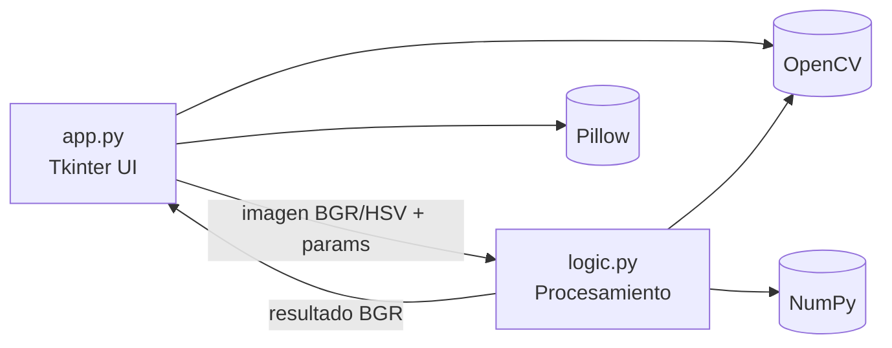

# Color Replace App

Reemplazo de color en imágenes (HSV + OpenCV) con interfaz de escritorio (Tkinter)

- Autor: (tu nombre)
- Fecha: 12 de febrero de 2026

<!--
Notas (1 frase): El objetivo es mostrar una herramienta simple pero robusta para reemplazar un color en una imagen con controles finos.
-->

---

## Agenda

- Problema y objetivo
- Funcionalidades (qué resuelve)
- Arquitectura y stack
- Flujo de usuario (demo)
- Algoritmo (HSV + máscara + mezcla)
- Consideraciones (calidad, rendimiento, límites)
- Próximos pasos

---

## Problema

Cambiar un color “objetivo” en una imagen parece fácil, pero en la práctica:

- La iluminación cambia el brillo del color
- Hay ruido, compresión JPG y gradientes
- Los bordes del objeto tienen antialiasing
- Se necesitan ajustes para evitar “recortes” y artefactos

---

## Objetivo del proyecto

Construir una app de escritorio que permita:

- Seleccionar un color objetivo con un click
- Elegir un color destino
- Controlar el reemplazo con parámetros simples
- Obtener un resultado visual inmediato

---

## Qué hace (funcionalidades)

- Carga imágenes `JPG/PNG/BMP`
- Selección por click del color objetivo en la imagen
- Selección del color destino con `colorchooser`
- Controles:
  - Tolerancia en HSV
  - Suavizado (feather) con Gaussian blur
  - Limpieza de ruido con morfología (open/close)
  - Fuerza de mezcla (alpha)
  - Opción “Mantener brillo (V)”
- Vista previa de selección (tinte rojo)

---

## Stack tecnológico

- **Python 3.9+**
- **Tkinter**: UI y eventos
- **OpenCV (`cv2`)**: conversión de color, máscaras, morfología
- **NumPy**: operaciones vectorizadas y blending
- **Pillow (PIL)**: mostrar la imagen en el `Canvas`

---

## Estructura del proyecto

- `app.py`
  - Interfaz (Tkinter)
  - Manejo de eventos (click en canvas)
  - Carga/visualización
  - Lectura de sliders y llamada a la lógica

- `logic.py`
  - Conversión RGB→HSV compatible con OpenCV
  - Creación de máscara HSV (incluye wrap-around en H)
  - Reemplazo con mezcla (alpha)
  - Vista previa (tinte)

---

## Arquitectura (alto nivel)



<!--
Notas: separación clara: UI no “sabe” del algoritmo; la lógica no “sabe” de Tkinter.
-->

---

## Flujo de usuario (demo)

1) **Cargar imagen**
2) **Seleccionar con click** → click sobre el color objetivo
3) **Elegir color destino…**
4) Ajustar sliders si hace falta
5) **Procesar** → se muestra resultado en el canvas

Tip: usar “Ver original” para comparar rápido.

---

## Mapeo de click a pixel real

La imagen se escala para caber en el `Canvas`.

- Se calcula `scale = min(cw/ow, ch/oh)`
- Se centra con offsets `(x0, y0)`
- Se traduce el click a coordenada de imagen:

$$
ix = \lfloor (x - x0) / scale \rfloor, \quad iy = \lfloor (y - y0) / scale \rfloor
$$

Esto permite seleccionar el HSV exacto del pixel original.

---

## Por qué HSV (y no RGB)

HSV separa mejor:

- **H (Hue / tono)**: “qué color es”
- **S (Saturation)**: intensidad del color
- **V (Value)**: brillo

Ventaja práctica: la selección es más robusta a cambios de iluminación que en RGB.

---

## Pipeline del algoritmo

```mermaid
flowchart TD
  A[Imagen BGR] --> B[Convertir a HSV]
  B --> C[Elegir HSV objetivo<br/>(click)]
  C --> D[Máscara HSV<br/>(inRange + wrap H)]
  D --> E[Suavizado<br/>Gaussian blur]
  E --> F[Limpieza<br/>Morph open + close]
  F --> G[Alpha = mask/255 * fuerza]
  G --> H[Mezcla<br/>H,S (y V opcional)]
  H --> I[HSV→BGR resultado]
```

---

## Máscara HSV (detalle)

Se define un rango alrededor del color objetivo:

- $H \in [H_t - tol, H_t + tol]$ con wrap-around en 0..179
- $S \in [S_t - tol, S_t + tol]$ (0..255)
- $V \in [V_t - tol, V_t + tol]$ (0..255)

Y se usa `cv2.inRange`.

---

## Wrap-around del tono (H)

OpenCV usa $H\in[0,179]$. Si $H_t - tol < 0$ o $H_t + tol > 179$:

- Se generan **dos rangos** y se combinan con OR

Esto evita fallos al seleccionar tonos cercanos a 0/179 (por ejemplo rojos).

---

## Feather (suavizado de bordes)

- La máscara binaria se suaviza con `GaussianBlur`
- Se fuerza kernel impar (si el usuario elige par, se suma 1)

Beneficio:
- bordes más naturales (menos “corte”)
- mejor integración con antialiasing

---

## Morfología (limpieza de ruido)

Con iteraciones `morph > 0`:

- `MORPH_OPEN`: elimina puntos pequeños
- `MORPH_CLOSE`: rellena huecos

Kernel: $3\times3$.

---

## Reemplazo con mezcla (alpha blending)

Se calcula:

$$
\alpha = \mathrm{clip}(mask/255 \cdot fuerza/100, 0, 1)
$$

Luego se mezclan canales HSV:

- $H_{new} = (1-\alpha)H + \alpha H_t$
- $S_{new} = (1-\alpha)S + \alpha S_t$
- $V_{new} = V$ si “Mantener brillo” está activo

---

## “Mantener brillo (V)”

Motivación:

- Cambiar el color sin “pintar encima” el volumen/luz del objeto

Efecto:
- El resultado suele verse más realista
- Especialmente útil en objetos con sombras y brillos

---

## Vista previa de selección

Antes de procesar, se puede mostrar:

- Imagen original
- Un tinte rojo ($BGR=(0,0,255)$) mezclado con la máscara

Esto permite validar rápidamente si la máscara “captura” lo correcto.

---

## Manejo de dependencias

El proyecto intenta importar:

- `cv2` + `numpy`
- `PIL` (Pillow)

Si faltan, muestra un mensaje de error (UI) y evita fallos en runtime.

---

## Rendimiento (intuición)

Operaciones principales son vectorizadas:

- `inRange`, blur, morfología: $O(N)$ sobre píxeles
- mezcla de canales HSV: $O(N)$

En imágenes grandes, el tiempo depende de:

- tamaño de imagen
- blur (kernel)
- `morph` (iteraciones)

---

## Calidad del resultado: knobs importantes

- **Tolerancia**: captura más/menos variación del color
- **Suavizado**: bordes más naturales vs. halo
- **Morfología**: reduce ruido pero puede comerse detalles finos
- **Fuerza mezcla**: reemplazo total vs. gradual

---

## Limitaciones actuales

- La tolerancia usa el mismo valor para H/S/V (simple, pero no siempre ideal)
- No hay guardado/exportación desde UI (solo preview en pantalla)
- Selección por un solo pixel (no promedio de área)
- El reemplazo interpola H linealmente (en el círculo del hue puede no ser óptimo)

---

## Próximos pasos (evolución posible)

- Guardar resultado (PNG/JPG)
- Promedio de color objetivo en un área (ej. 5x5 alrededor del click)
- Tolerancia separada por canal (H vs S vs V)
- Previsualización “en vivo” al mover sliders

---

## Cómo correr la app (rápido)

Instalar dependencias:

- `pip install opencv-python numpy pillow`

Ejecutar:

- `python app.py`
- En Windows, alternativa: `py app.py`

---

## Cierre

- App simple, enfocada y explicable
- Reemplazo robusto usando HSV + máscara con controles
- Pipeline claro y extensible

Preguntas

<!--
Notas: ofrecer demo final si hay tiempo.
-->
